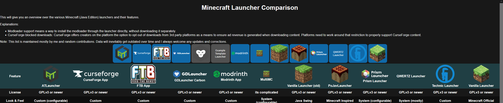

# Minecraft Launcher Comparison

> [!NOTE]  
> The comparison table is not available in the readme anymore, go to https://mc-launcher.tayou.org/ instead.

Alternatively use the instructions below to generate the site locally.

## Building

This project has been updated to use a static site generator, providing more features than a basic markdown file can.
in order to build the page locally for development do:
1. clone this repo from the button in the top right, IDE, or using your terminal of choice: 
   `git clone https://github.com/TayouVR/MinecraftLauncherComparison.git MinecraftLauncherComparison`
2. `cd MinecraftLauncherComparison`
3. `npm run install`
4. `npm run dev` or any other applicable launch configuration from below

## Commands

All commands are run from the root of the project, from a terminal:

| Command                   | Action                                           |
| :------------------------ | :----------------------------------------------- |
| `npm install`             | Installs dependencies                            |
| `npm run dev`             | Starts local dev server at `localhost:4321`      |
| `npm run build`           | Build your production site to `./dist/`          |
| `npm run preview`         | Preview your build locally, before deploying     |
| `npm run astro ...`       | Run CLI commands like `astro add`, `astro check` |
| `npm run astro -- --help` | Get help using the Astro CLI                     |

https://mc-launcher.tayou.org/
